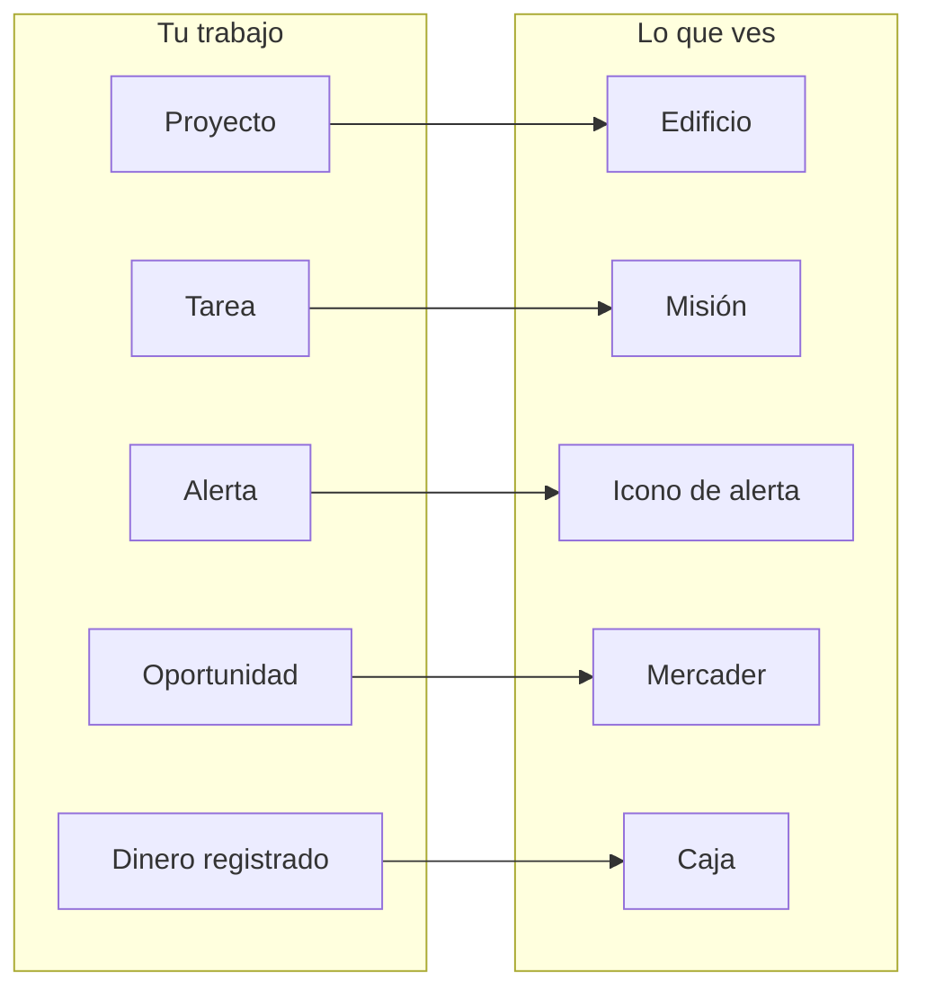
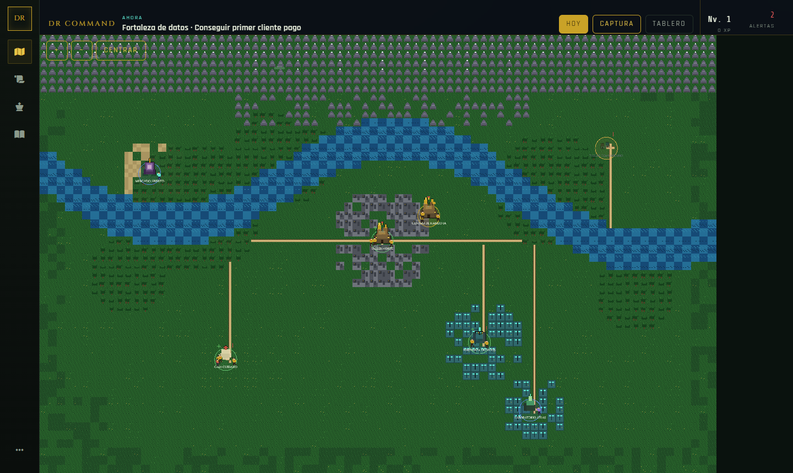
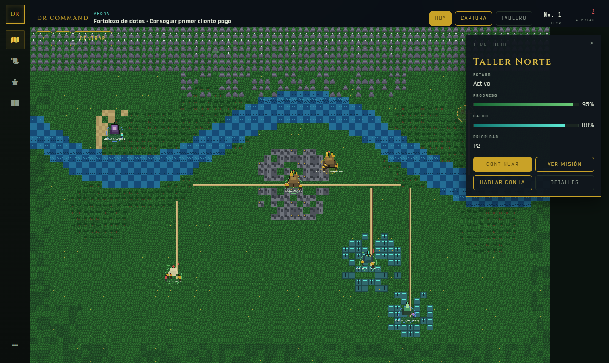
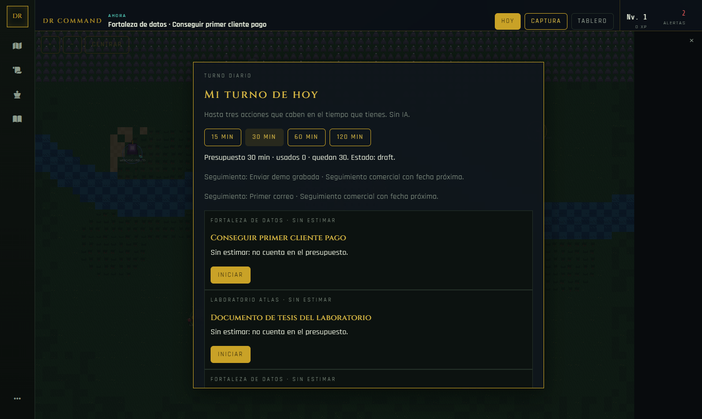
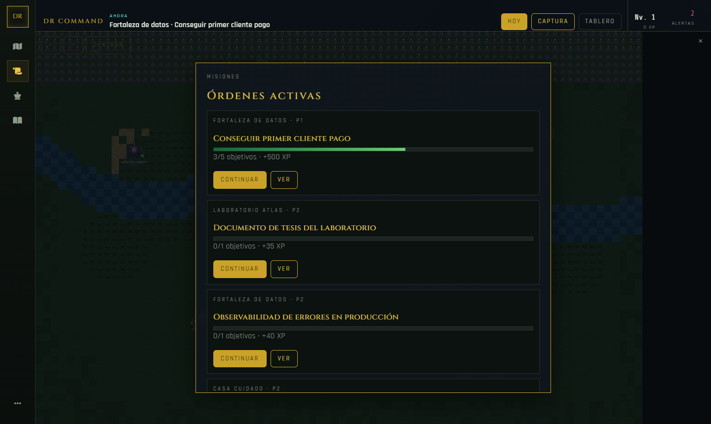
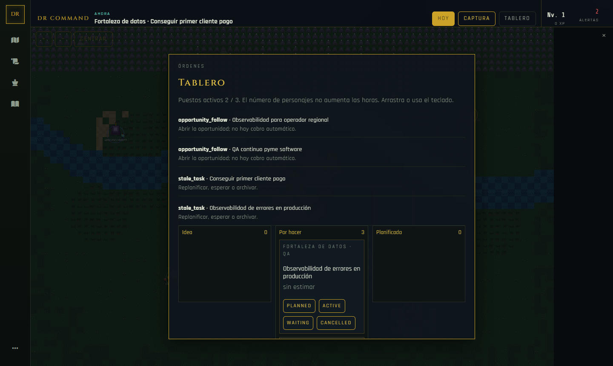
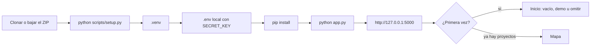
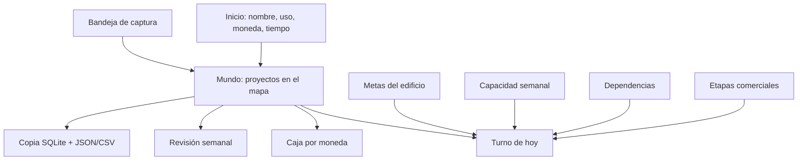
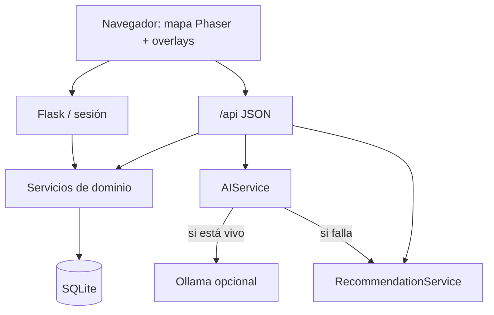
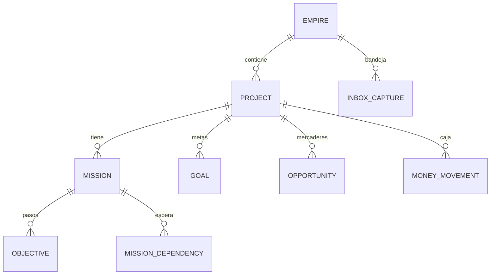

# DR Command

Tablero **local** para quien gestiona un emprendimiento, trabajos freelance o
varios proyectos a la vez. La pantalla principal es un **mapa**: cada proyecto
es un edificio, cada tarea es una misión, cada problema es una alerta y cada
oportunidad comercial es un mercader.

No está atado a una empresa, una marca ni un portafolio concreto. Tú pones el
nombre del mundo, la moneda, el horario y los proyectos. Los datos viven en un
archivo SQLite en **tu máquina**. No hay cuenta en la nube, no hay telemetría y
no hace falta pagar una API para usarlo.



---

## Por qué usarla

La mayoría de herramientas parten de una lista. DR Command parte de una
pregunta: **¿qué está pasando en mi mundo y qué hago ahora con el tiempo que
tengo?**

### Ventajas

**1. Ves el conjunto, no solo la siguiente tarjeta.**  
Cinco frentes abiertos en un kanban se parecen todos. En el mapa cada proyecto
es un edificio con salud, alertas y fase. Sabes qué está vivo, qué está
bloqueado y qué puedes dejar quieto hoy.

**2. El día cabe en el día.**  
Hoy propone **hasta tres** misiones que entran en 15, 30, 60 o 120 minutos. Si
solo cabe una, muestra una. No rellena huecos con tareas imposibles para que
el tablero “se vea lleno”.

**3. Una sola fuente de verdad.**  
Mapa, lista, tablero, finanzas e historial leen las **mismas** entidades. No
hay un tablero decorativo distinto del trabajo real. Si mueves una misión de
columna, cambia esa misión.

**4. Dinero honesto.**  
Marcar una oportunidad como ganada **no** inventa un ingreso. Cobrar 40 de 100
deja 60 pendientes. La caja va en centavos, por moneda, y no se mezcla. No
sustituye un banco ni la contabilidad formal: registra lo que tú anotas.

**5. Tus datos no se van.**  
SQLite en `instance/`. Sin SaaS, sin telemetría, sin cuenta externa. Puedes
trabajar sin internet (el asesor por reglas sigue funcionando; Ollama es
opcional y también es local).

**6. Empieza vacío, no con el portafolio de otro.**  
Una instalación nueva no te obliga a un mundo ajeno. Eliges mundo vacío, una
plantilla o una demostración ficticia marcada `[DEMO]`. Borrar la demo no borra
tu trabajo.

**7. La IA recomienda; tú aplicas.**  
El asesor no borra, no manda correos, no despliega y no cobra. Sin Ollama hay
reglas locales. Con Ollama el texto puede ser más rico; si el modelo falla,
vuelves a las reglas y el programa lo indica.

**8. Portable.**  
Python 3.11+, un comando para instalar, un comando para arrancar. Windows,
macOS y Linux. Sin Docker, Node, PostgreSQL ni clave de API para el uso básico.

**9. La parte lúdica es opcional.**  
Perfiles Lúdico, Equilibrado y Tranquilo. El XP no completa las metas del
negocio. Pausar un proyecto no derrumba el edificio ni te presenta como un
fracaso.

### Si hoy te pasa esto

| Situación | Lo que hace DR Command |
| --- | --- |
| Cinco frentes y no ves el conjunto | Mapa con estado, salud y alertas por edificio |
| La lista no cabe en el día | Hoy: hasta 3 acciones según minutos reales |
| Cierras tickets y el negocio no avanza | Metas distintas del XP |
| No sabes qué impide seguir | Dependencias y bloqueos, también entre proyectos |
| Mezclas “gané un trato” con “ya cobré” | Caja en centavos, pendiente ≠ efectivo |
| Se te escapan seguimientos | Mercaderes con etapa y próxima acción |
| Anotas ideas en el aire | Captura `Ctrl+Shift+K` a una bandeja |
| La IA decide o exige API de pago | Asesor opcional; sin Ollama también corre |
| Tus datos viven en un SaaS | SQLite local, sin telemetría |

### Qué no es

No es un ERP, un CRM empresarial, un banco ni un sustituto de la factura
oficial. No envía correo. No publica en internet por sí solo. Está pensado para
**una persona (o un gremio opt-in)** en un ordenador, no para exponer el puerto
a la red.

---

## Así se ve

Capturas de una partida local con la demostración (`[DEMO]`). En un mundo vacío
los edificios llevan los nombres que tú pongas.



| Un edificio | El turno de hoy |
| --- | --- |
|  |  |





---

## Requisitos

| Necesario | Opcional |
| --- | --- |
| [Python 3.11 o superior](https://www.python.org/downloads/) | [Ollama](https://ollama.com) para el asesor con modelo local |
| Un navegador (Chrome, Edge, Firefox, Safari) | [Tiled](https://www.mapeditor.org/) si quieres editar el terreno del mapa |
| ~200 MB de disco para el entorno virtual | |

No hace falta cuenta de GitHub, Node, Docker, PostgreSQL ni una clave de API.

Comprobado al publicar: **Windows**. macOS y Linux usan el mismo instalador.

En el instalador de Python para Windows marca **“Add python.exe to PATH”**.

---

## Instalación (cualquiera)

No pide tokens. No crea cuentas. Puedes clonar **o** bajar el ZIP.

### 1. Traer el proyecto

```bash
git clone https://github.com/FernandoLizana/command-world.git
cd command-world
```

Sin Git: en GitHub → **Code** → **Download ZIP**, descomprimes y entras a esa
carpeta.

### 2. Instalar

En la carpeta del proyecto:

```bash
python scripts/setup.py
```

Si `python` no existe, prueba `py -3.11 scripts/setup.py` (Windows) o
`python3 scripts/setup.py`.

Ese script:

1. Comprueba que Python sea 3.11 o más.
2. Crea (o reutiliza) el entorno `.venv`.
3. Copia `.env.example` → `.env` **solo si no existe**, con una `SECRET_KEY` aleatoria.
4. Crea `instance/` para la base y las copias.
5. Instala `requirements.txt`.

Repetirlo **no borra** tu mundo.

### 3. Arrancar

```bash
# Windows
.venv\Scripts\python app.py

# macOS / Linux
.venv/bin/python app.py
```

Abre [http://127.0.0.1:5000](http://127.0.0.1:5000).

Usuario inicial: **`admin` / `admin`**. Es una instalación **local**. Cámbialo
en `.env` (`ADMIN_PASSWORD`, `SECRET_KEY`) **antes** de guardar trabajo que te
importe, y no expongas el puerto a internet.



### Pasos manuales (si no usas el script)

```bash
python -m venv .venv

# Windows
.venv\Scripts\activate
copy .env.example .env

# macOS / Linux
source .venv/bin/activate
cp .env.example .env

python -m pip install -r requirements.txt
python app.py
```

Después de copiar `.env` a mano, cambia `SECRET_KEY` (no dejes
`change-me-in-production`) y `ADMIN_PASSWORD`.

### Primera vez en el mapa

- **Comenzar vacío** — un mundo con tu nombre y, si quieres, el primer proyecto.
- **Explorar demostración** — seis edificios ficticios (`Taller Norte`,
  `Fortaleza de datos`, etc.), marcados `[DEMO]`. Borrar la demo no borra tu
  trabajo real.
- **Omitir** — entras al mapa y configuras después en Ajustes.

---

## Recorrido de diez minutos

1. Entras al **mapa**.
2. Pulsas **Hoy**, eliges 30 minutos, miras qué cabe.
3. Clic en un edificio → **Continuar** o **Ver misión**.
4. `Ctrl+Shift+K` captura una frase; luego la conviertes en misión, nota u
   oportunidad.
5. **Lista** (en `···` o el overlay) es la misma información sin depender del
   canvas: teclado y móvil.
6. En **Finanzas** anotas un cobro o un gasto. Ganar un mercader no mueve la caja.

Escape cierra paneles.

### Equivalencias

| En el mapa | En el trabajo |
| --- | --- |
| Edificio | Proyecto |
| Misión / unidad | Tarea |
| Alerta (icono rojo) | Problema o bloqueo |
| Mercader | Oportunidad comercial |
| Centro de mando | Asesor (reglas o modelo local) |
| Caja | Dinero que **tú** registras |
| Bitácora | Relato del día; guardar no ejecuta nada |
| Tablero | Las mismas misiones en columnas de estado |

### Barra de mando (HUD)

De izquierda a derecha: **Ahora** (prioridad del turno), **Hoy / Captura /
Tablero**, **nivel y XP** del comandante, **alertas** (incidencias altas o
críticas abiertas). El recuento de alertas va anclado a la derecha para no
caer sobre el mapa.

Navegación del rail: **Mapa · Misiones · IA · Historial**. El menú `···` abre
Ajustes, Finanzas, revisión semanal, Lista, Bitácora y salir.

### Atajos

| Tecla | Acción |
| --- | --- |
| `Ctrl+Shift+K` | Captura rápida |
| Escape | Cerrar overlay y volver al mapa |
| Clic en edificio | Panel de territorio |
| Clic en unidad | Abrir esa misión |

---

## Qué puede hacer el programa



| Área | Qué hace |
| --- | --- |
| Mundo | Nombre, zona horaria, moneda, minutos semanales, perfil lúdico |
| Turno diario | Hasta 3 misiones dentro del presupuesto; se conserva al recargar |
| Metas | Principal y secundarias; el XP no las completa por sí solo |
| Capacidad | Minutos planificados vs disponibles; lo sin estimar se ve como sin estimar |
| Bloqueos | Dependencias entre misiones (sin ciclos) y esperas externas |
| Finanzas | Ingresos/gastos efectivos y pendientes, en centavos, **sin mezclar monedas** |
| Comercial | Nuevo → Contactado → Conversación → Propuesta → Negociación → Ganado/Perdido |
| Plantillas | Seis puntos de partida (servicio, tienda, app, encargo, campaña, aprendizaje) |
| Captura | Una frase basta; convertir dos veces no duplica |
| Tablero | Columnas de estado sobre las mismas misiones; cupo WIP de la persona |
| Bitácora | Escribes lo ocurrido; interpretar propone; aplicar ejecuta lo que marques |
| Notas | Contexto del edificio para retomarlo |
| Asesor | Reglas locales siempre; Ollama opcional; nunca aplica solo |
| Semana | Compara lo hecho con lo previsto y guarda la revisión |
| Datos | Copia `.db` coherente, export JSON/CSV, restauración con respaldo previo |

Estados de una misión (tablero): idea → por hacer → planificada → activa →
en espera / en revisión → hecha. La espera exige un motivo. Completar una
sesión de trabajo **no** marca la misión hecha.

---

## Arquitectura

Un proceso Flask. Jinja + Phaser en el navegador. SQLite por defecto. Phaser y
los sprites van **vendidos en el repo** (el mapa no depende de un CDN).



```
app.py                 arranque local (127.0.0.1:5000)
wsgi.py                gunicorn si lo sirves tú
scripts/setup.py       instalación
app/models             proyectos, misiones, metas, dinero…
app/services           turno, finanzas, captura, respaldo…
app/routes             HTML + /api
app/static/game        Phaser, tilemap, sprites
instance/              base y copias (no se versiona)
```

Los edificios **no** se guardan en el JSON de Tiled. El tilemap es terreno. Las
ciudades salen de `GET /api/map`. Inventario de pixel art: [`ASSETS.md`](ASSETS.md).



### API interna (sesión requerida)

No es una API pública. Sirve al propio navegador, con cookie de sesión y CSRF.

| Método | Ruta | Uso |
| --- | --- | --- |
| GET | `/api/map` | Edificios y consejo “ahora” |
| GET/POST | `/api/today` | Turno diario |
| GET/POST | `/api/inbox` | Captura |
| GET/POST | `/api/money` | Movimientos |
| GET/POST | `/api/world` | Preferencias del espacio |
| GET/POST | `/api/week` | Revisión semanal |
| GET | `/api/board` | Tablero de misiones |
| POST | `/api/backup/snapshot` | Copia SQLite |

---

## IA opcional

El programa funciona **sin** modelo. Si quieres texto más rico:

```bash
ollama serve
ollama pull llama3.2
```

En `.env`: `OLLAMA_ENABLED=true`, `OLLAMA_URL=http://localhost:11434`.
Si el modelo no responde, el asesor por reglas sigue contestando y lo indica.

---

## Datos y copias

- Base: `instance/empire.db` (está en `.gitignore`; no se sube).
- Copia: Ajustes → **Hacer copia ahora** (respaldo coherente de SQLite, no un
  copiado del archivo mientras hay escrituras).
- Export JSON y CSV desde Ajustes.
- Restaurar un `.db` guarda antes el estado actual.

Una copia en el mismo disco **no** te protege si se pierde el disco.

```bash
flask seed      # no hace nada si ya hay proyectos
flask reseed    # borra tablas y carga la demo genérica (destructivo)
```

---

## Seguridad de esta instalación

Esto es un programa **de escritorio servido en localhost**, no un producto
multiinquilino. Trátalo como tal.

- Arranca en `127.0.0.1`. No lo publiques en `0.0.0.0` ni detrás de un túnel
  sin autenticación extra.
- `scripts/setup.py` genera una `SECRET_KEY` distinta en cada máquina. No
  reutilices `change-me-in-production`.
- Cambia `ADMIN_PASSWORD` (y el usuario, si quieres) en `.env` antes de datos
  reales. `admin` / `admin` es solo el primer acceso local.
- `.gitignore` excluye `.env`, `instance/`, SQLite y credenciales típicas.
- Las integraciones de correo o GitHub del código están **desconectadas**
  (`enabled() = False`): no envían nada.
- La IA no tiene permiso para mutar producción, mandar mail ni mover dinero.

### Qué no debe haber en este repositorio

Este GitHub es **público**. El historial de este repo es un snapshot huérfano
(no arrastra un `.env` ni una base tuya). No debe contener:

- Tokens (GitHub, OpenAI, Google, etc.)
- Contraseñas reales
- Tu `.env`
- `instance/empire.db`
- Rutas de usuario
- Nombres de empresas o personas **reales** en la semilla (la demo usa
  edificios y contactos ficticios marcados `[DEMO]`)

La semilla de demostración usa nombres genéricos (`Taller Norte`, `Paula Rivas`
como ficha inventada, etc.). No son clientes reales.

El usuario de GitHub del clon es visible en la URL del repositorio; eso es
propio de GitHub, no un secreto del programa.

---

## Variables de entorno

Plantilla: [`.env.example`](.env.example).

| Variable | Rol |
| --- | --- |
| `SECRET_KEY` | Firmas de sesión. Única por máquina |
| `DATABASE_URL` | SQLite por defecto |
| `DEMO_MODE` | Si es true, el login recuerda que existe `admin` inicial |
| `ADMIN_USERNAME` / `ADMIN_PASSWORD` / `ADMIN_EMAIL` | Dueño local |
| `OLLAMA_*` | Cliente HTTP al modelo local |
| `SOUND_ENABLED` | Audio preparado; apagado por defecto |
| `FLASK_DEBUG` | Dejar `false` salvo que estés desarrollando |

---

## Pruebas

```bash
python -m unittest tests.test_evolve tests.test_gamification
```

Cubre cobro parcial, ciclos de dependencias, presupuesto del turno, captura
idempotente, sobrecarga semanal y el tablero (WIP, esperas).

---

## Si algo falla

| Síntoma | Qué probar |
| --- | --- |
| `python` no se reconoce | Instala Python 3.11+ y marca PATH; o usa `py -3.11` |
| Pide Python 3.11 | El instalador rechaza 3.10 y anteriores a propósito |
| Puerto 5000 ocupado | Cierra el otro `python app.py` o cambia el puerto en `app.py` |
| Login no entra | `admin` / `admin` la primera vez; revisa `.env` si lo cambiaste |
| Hoy o el tablero dan error en Windows | `python -m pip install tzdata` dentro del `.venv` (ya va en `requirements.txt`) |
| El mapa en blanco | Recarga; Phaser y los sprites van en el repo, no en un CDN |
| El asesor no habla “con modelo” | Es normal sin Ollama; las reglas locales siguen |

---

## Licencia

Aún no hay licencia pública. El código y el pixel art son originales de este
proyecto. No copies HUD ni sprites de juegos comerciales. Puedes clonar e
instalar para uso local; si quieres redistribuir o venderlo, habla con el
autor del repositorio.
